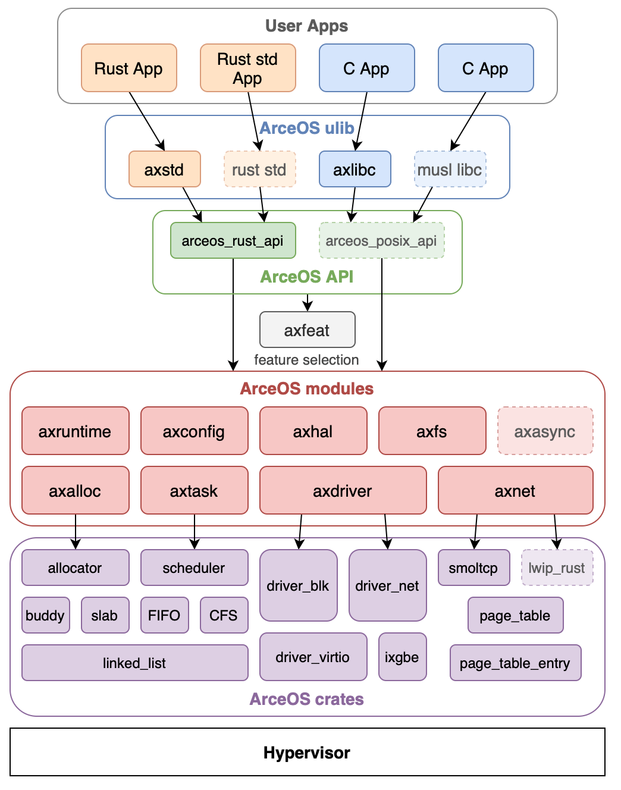

# 架构设计

本章节简要介绍组件化系统 ArceOS 中不同模块的功能与接口文档。

## ArceOS

基座内核 ArceOS 以组件化内核的思想进行设计，设计架构图如下：

每一个模块的简要介绍如下：

- crates layer: 内核无关组件，如 `page_table`, `slab_allocator`, `spinlock` 等，可以方便地给其他内核进行复用

- modules layer: 内核相关的组件。他们与内核的核心功能相关，不容易解耦出来给其他内核使用，但是对内核本身的功能以及重构有重要作用。
    - axalloc: 用于内核内存分配的模块
    - axfs: 文件系统管理模块, 接入了 fat32
    - axhal: 硬件抽象层模块
    - axnet: 网络管理模块，接入了 smoltcp 网络协议栈
    - axdriver: 驱动管理模块
    - axtask: 任务管理模块，包括任务单元的定义和调度功能的实现
    - axsync: 同步原语模块，包括一些 mutex 等同步原语等实现
    - axmm: 地址空间管理模块，包括内存映射等功能的实现

- axfeat: feature 描述层，用于进行 feature 的定制和转发，从而实现组件定制化的功能
    - feature 是 rust 条件编译的重要环节，详见[文档](https://doc.rust-lang.org/cargo/reference/features.html)

- api layer: ArceOS 对外提供的接口层
    - arceos_posix_api: POSIX 接口兼容实现层，在初始时是调用了 Unikernel 的接口，在 Starry 中会为其加入更多宏内核的支持
    - arceos_api: Unikernel 自身提供的接口层，用于其他应用程序调用内核的功能

- ulib layer: 用户库层，将 api layer 的接口进一步封装为更加兼容、常见的接口
    - axstd: rust std 的 Unikernel 实现，它调用的是 arceos 的功能，但是提供了更加常见的 std 接口
    - axlibc: libc 的 Unikernel 实现，它调用的是 arceos 的功能，但是提供了更加常见的 libc 接口

- user layer: 用户层，包括用户程序和用户程序的测试用例
    - rust app: rust 语言编写的用户程序，调用 axstd 从而调用 Unikernel 内核的功能
    - c app: c 语言编写的用户程序，与 axlibc 链接从而调用 Unikernel 内核的功能
    
关于 ArceOS 的接口更加详细的说明文档位于：[arceos](https://arceos.org/arceos/)

其他相关材料包括：
- Unikernel 架构说明： https://dl.acm.org/doi/10.1145/2490301.2451167
- ArceOS 指导书 https://rcore-os.cn/arceos-tutorial-book/index.html
- ArceOS 教学视频：https://opencamp.cn/os2edu/camp/2024fall/stage/3

## Starry

Starry 的目录结构 TODO